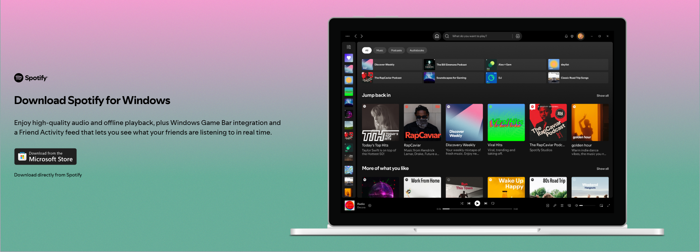

# Ventana de instalación de Spotify

## Introducción 

A partir de esta pestaña podrás instalar la aplicación de escritorio de spotify.

## Contenido

Se informa al usuario donde puede encontrar la aplicación de Spotify en su ordenador.

En un botón remarcado se le redirige a la tienda oficial para descargarlo, debajo en pequeñito sale un enlace para descargar directamente el launcher desde la web.

