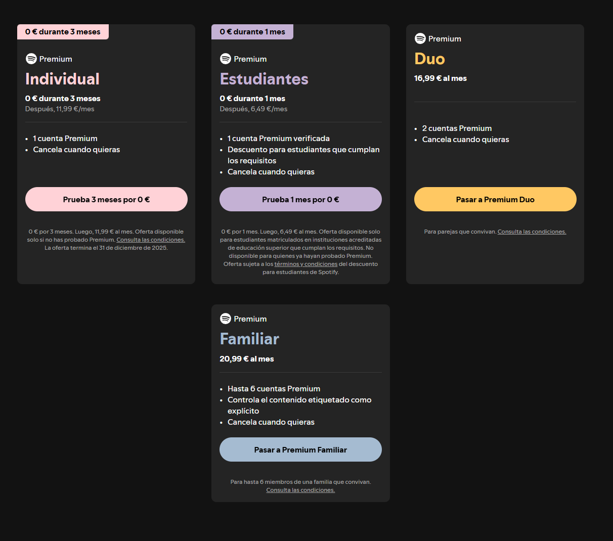

# Ventana de pago Spotify

## Introducción

La pantalla donde un usuario puede confirmar la compra de su licencia "premium". 

*Importante.* Al pulsar la ventana de pago, se abre otra pestaña para realizar el pago por seguridad en su web oficial.

## Estructura

Esta pantalla se divide en tres secciones.

### ___Selección de plan___

Es donde puedes seleccionar el tipo de plam premium que deseas comprar

Cada plan contiene unos beneficios distintos y tiene un precio distinto, aqui el usuario puede escoger el que más se adecue a él.

### ___Metodo de pago___

Aquí eliges cómo quieres pagar:

- Tarjeta de Crédito/Débito: Pide los números de tu tarjeta, la fecha de caducidad y el código de seguridad (CVV).

- PayPal: Te permite iniciar sesión en PayPal para no usar la tarjeta directamente.

- Tarjetas Regalo / Prepago: Una casilla para canjear códigos si compraste una tarjeta física en una tienda.

### ___Resumen de la compra___

Es el "ticket" antes de comprar. Te informa de:

- Lo que pagas en el momento.

- Lo que pagarás después: El precio mensual normal.

- Fecha de renovación: El día exacto en que te volverán a cobrar.