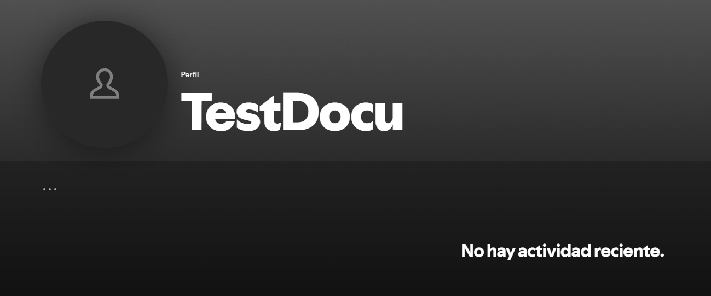

# Perfil

Frontend apartado __profile__ de Spotify.

## Contenidos
    - Nombre de usuario
    - Biblioteca
    - Editar perfil

## Referencias API
- [API perfiles de Spotify](https://developer.spotify.com/documentation/web-api/reference/get-current-users-profile)